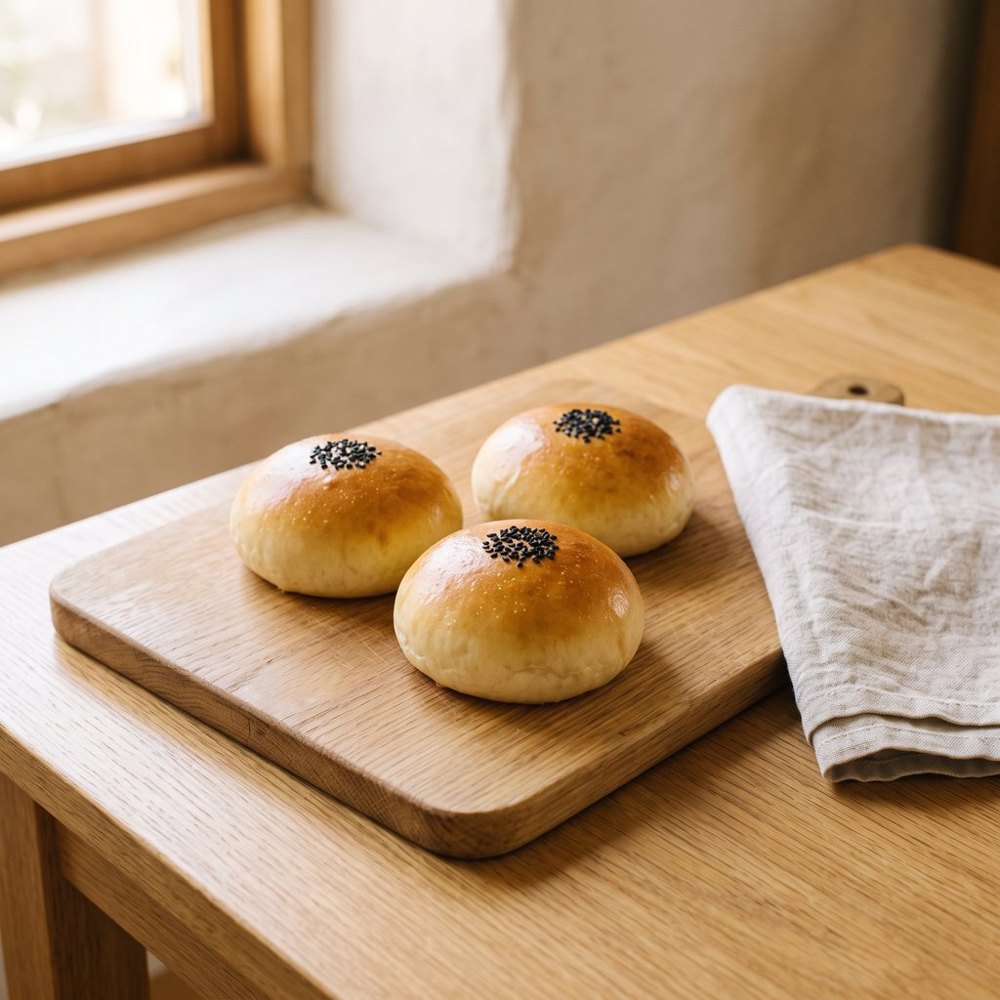
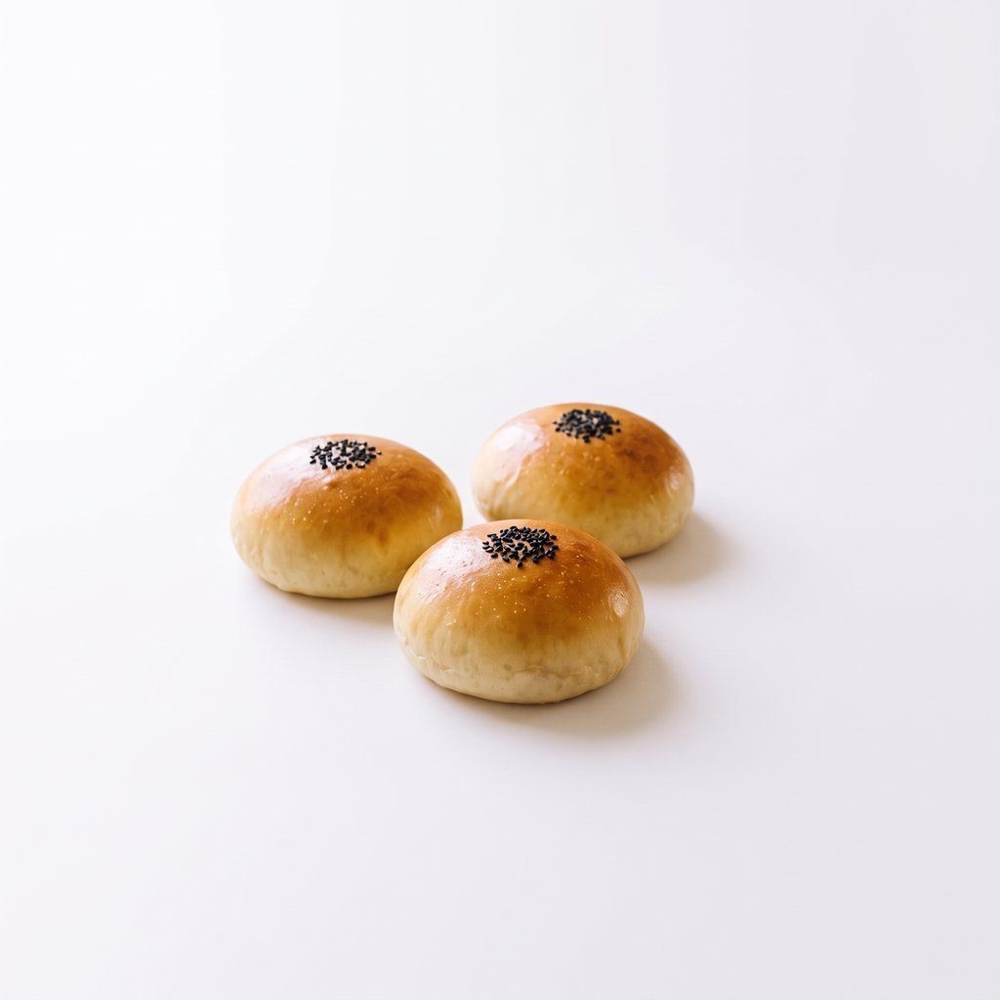
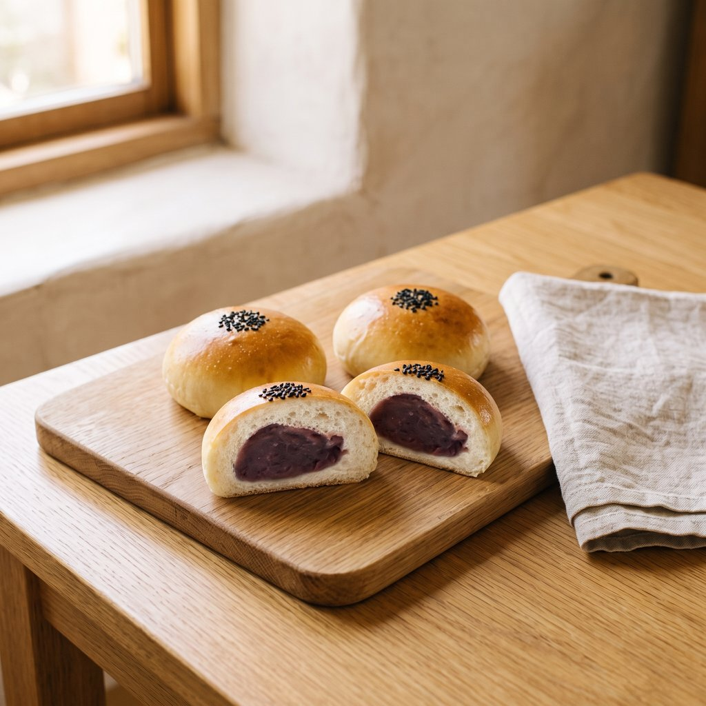
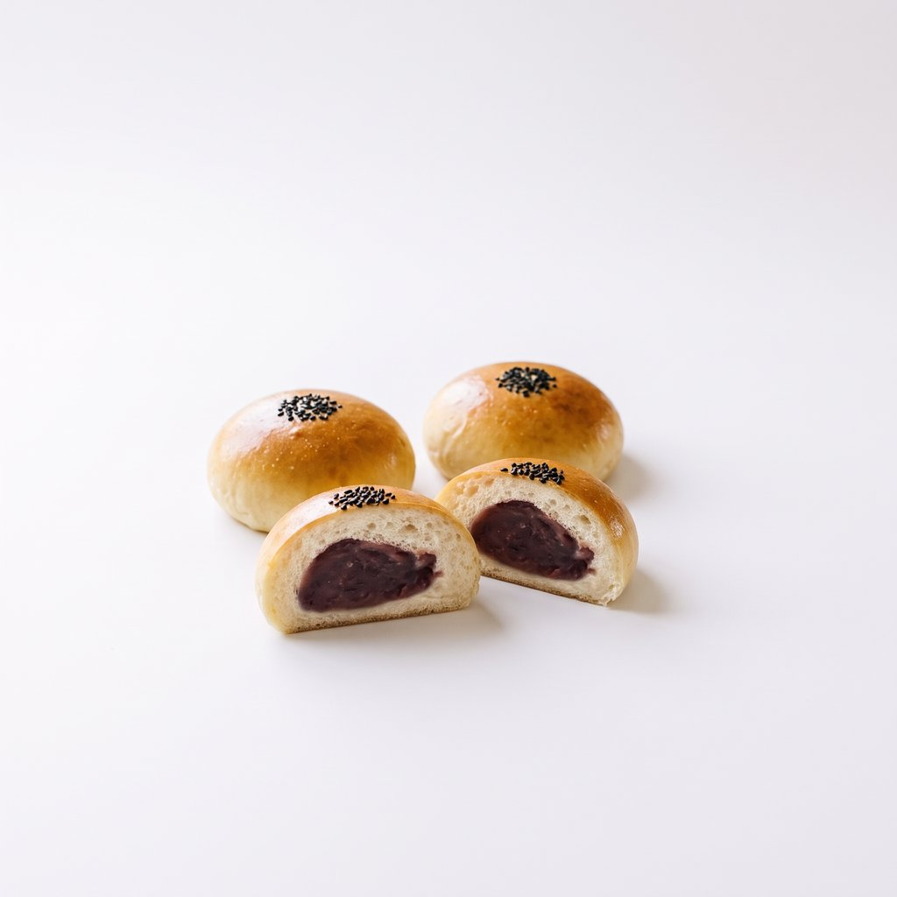

# Bread Photo Skill

An AI skill that writes image prompts for **four matching photos of a bread**, in a calm, bright café style inspired by the Japanese film *Kamome Diner* (かもめ食堂) and the drama *Pan to Soup to Neko Biyori* (パンとスープとネコ日和): window light, a white plaster wall, pale wood, linen, and simple homemade bread.

| Photo | Background |
|---|---|
| Whole bread | café table by a window |
| Whole bread | none (transparent PNG) |
| Cross-section | the same café table |
| Cross-section | none (transparent PNG) |

All four show the same loaf, so they fit together on a website: for example, the café photo on a product page and the transparent versions on a menu.

## Example: anpan (Japanese sweet red bean buns)

Made with `/bread-photo:photo-set anpan` and Gemini.

<table>
  <tr>
    <td align="center"><br>Whole — café</td>
    <td align="center"><br>Whole — no background</td>
  </tr>
  <tr>
    <td align="center"><br>Cross-section — café</td>
    <td align="center"><br>Cross-section — no background</td>
  </tr>
</table>

The "no background" examples are shown on white. After the last step (Remove Background), they become transparent PNGs.

## What you need

- **Claude Code**, to run the skill. It works in other AI tools that support Agent Skills too; see "Other AI tools" below.
- **A Gemini account** ([gemini.google.com](https://gemini.google.com)) to make the images. The skill writes the prompts; you paste them into Gemini.
- **A photo of the inside of each bread**, for the cross-section. A photo of your own bread is best; a free photo from Unsplash or Pexels works too. **Crop it to the cut face**: the whole cut surface, with only a thin edge of crust and as little background as possible. Too much, and Gemini copies the slice's shape; too little (a zoomed-in patch), and the holes come out the wrong size.

## Install

In a terminal:

```bash
claude plugin marketplace add xixifish/bread-photo-skill
```

```bash
claude plugin install bread-photo@bread-photo-skill
```

## Use

1. In your project folder, create a folder called `crumb-photos` and add a photo of the inside of your bread, named after the bread, for example `crumb-photos/shokupan.jpg`.
2. Start Claude Code in that folder and type:

   ```
   /bread-photo:photo-set shokupan
   ```

3. Claude replies with four numbered steps. Open a **new Gemini chat** and send them one at a time, attaching the file each step names.
4. For the two "no background" photos, Gemini gives you the bread on white. To make the background transparent on a Mac, right-click the image in Finder → **Quick Actions** → **Remove Background**.

You can also just ask in plain words, for example "make the photo set for my rye bread".

**Photo shape.** Photos are square by default. Add `portrait` or `landscape` after the bread name to change it, for example `/bread-photo:photo-set shokupan landscape` for a website banner. All four photos in a set come out the same shape. Gemini doesn't let you choose an exact pixel size, so resize afterwards if you need one (on a Mac: Preview → Tools → Adjust Size).

## Why it works this way

These rules came from testing, not guesswork:

- **Gemini, not ChatGPT.** ChatGPT's cross-sections looked artificial even with a reference photo. Gemini's looked real.
- **A real crumb photo.** Described in words alone, the inside of the bread came out looking like craters, cotton or foam, whatever the wording.
- **One chat, whole bread first.** Each photo is an edit of an earlier one, so the loaf stays identical across all four.
- **White first, transparent after.** Asking Gemini for a transparent background gives a fake checkerboard drawn into the picture.

## Limits

- **The crumb photo decides the cross-section.** With a poor one, the inside looks fake; changing the prompt wording didn't fix it in testing, but a better photo did. Choose a sharp photo, cut the same way as the skill cuts the bread (for rolls: upright, straight through the center), with no toppings your bread doesn't have (icing, nuts, zest).
- **Open-crumb breads like sourdough** can take a few tries before the cross-section looks right.
- **Retrying in the same Gemini chat** often gives back an almost identical image. Describe what to change instead, or start a new chat with your saved photo attached.

## Other AI tools

The skill follows the open [Agent Skills](https://agentskills.io) format. To use it without the Claude Code plugin, copy the folder `plugins/bread-photo/skills/photo-set/` into your tool's skills folder. For Claude Code without the plugin, that's `~/.claude/skills/photo-set/`, and the command becomes `/photo-set shokupan`.

## License

MIT. See [LICENSE](LICENSE).
